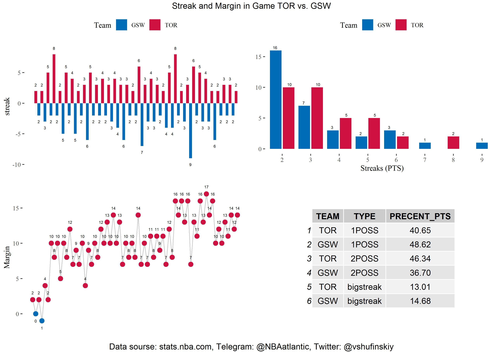

## Анализ стриков и изменения разницы в счёте в играх НБА

### Что такое стрики и смысл их расчёта

Стрики - это очки, набранные в промежутоквремени, когда соперник очков не набирал.

**Пример**: Началась игра, Команда А набрала два очка, затем Команда Б набрала три очка, потом команда Б набрала 1 очко, игра закончилась. Мы имеем два стрика: 2-ух очковый у Команды А и 5-ти очковый у команды Б.

Анализ таких стриков в игре может позволить оценить динамику её развития, а также обратить внимание на те моменты, когда команда "проседает". Помимо графика стриков представлены ещё два графика и одна таблица:

* Количество стриков каждой длины по командам.
* Изменение разницы в счёте после каждого стрика
* Таблица с процентом очков по типам стриков

### Таблица с процентом очков по типам стриков.
Каждый стрик относится к одной из трёх категорий в соответствии со своей величиной:

* 1POSS (стрик в одно владение: сюда относятся стрики величиной 1, 2 или 3 очка)
* 2POSS (стрик в два владения: 4, 5 или 6 очков)
* bigstreak (стрики величиной в 7+ очков).

Код для построение таблицы:

```r 
  gtable <- table1[, TYPE := if_else(abs(streak) <= 3, "1POSS",
                                       if_else(abs(streak) <= 6, 
                                               "2POSS", "bigstreak"))][
                                                 , .(POSS1 = sum(abs(streak))), 
                    by = .(TYPE, PLAYER1_TEAM_ABBREVIATION)][
                      , PTS := sum(POSS1), by = PLAYER1_TEAM_ABBREVIATION][
                        , PRECENT_PTS := round(POSS1/PTS*100, digits = 2)][order(TYPE)][
    , .(TEAM = PLAYER1_TEAM_ABBREVIATION, TYPE, PRECENT_PTS)]
  
  gtable <- tableGrob(gtable)
```

Функция `tableGrob` используется для того, чтобы мы могли добавить таблицу на график.

### Преобразования данных для подсчёта стриков

В явном виде из данных, получаемых из play-by-play статистики игры получить стрики нельзя. Поэтому нам нужно выполнить ряд преобразований, чтобы их получить.
Начальная таблица:

|Home|Away| 
|---|---|
|0|1|
|1|0|
|2|0|
|3|0|
|0|2|
|0|3|
|0|3|
|2|0|
|0|1|

Конечная таблица:

|streak| 
|---|
|1|
|-6|
|8|
|2|
|1|

Код, для преобразования:

```r 
table1 <- table1[, c("min", "sec") := tstrsplit(PCTIMESTRING, ":", fixed = TRUE)][
    , PCTIMESTRING := NULL][
      , c("min", "sec") := lapply(.SD, as.numeric), .SDcols = c("min", "sec")][
        , "Time" := abs((min * 60 + sec) - 720 * PERIOD)
        ][, c("PERIOD", "min", "sec") := NULL][
          , c("Away", "Home") := tstrsplit(SCORE, "-", fixed = TRUE)][
          !is.na(Home)][, SCORE := NULL][
            , c("Away", "Home") := lapply(.SD, as.numeric), .SDcols = c("Away", "Home")][
            , ":=" (Away = Away - lag(Away, default = 0),
                    Home = Home - lag(Home, default = 0))][Away != 0 | Home != 0][
                      , Away1 := cumsum(Away)][, Away1 := if_else(Away == 0, 0, Away1)][
                      , Away1 := if_else(lead(Away1, default = 0) == 0, Away1, 0)]
  
  table2 <- table1[Away1 == 0]
  table3 <- table1[Away1 != 0]
  
  table3 <- table3[, Away1 := Away1 - lag(Away1, default =0)]
  
  table1 <- bind_rows(table2, table3)
  
  table1 <- table1[order(Time)][, Home1 := cumsum(Home)][
    , Home1 := if_else(Home == 0, 0, Home1)][
    , Home1 := if_else(lead(Home1, default = 0) == 0, Home1, 0)]
  
  table2 <- table1[Home1 == 0]
  table3 <- table1[Home1 != 0]
  
  table3 <- table3[, Home1 := Home1 - lag(Home1, default =0)]
  
  table1 <- bind_rows(table2, table3)
  
  table1 <- table1[order(Time)][, Home1 := -(Home1)][Home1 != 0 | Away1 != 0][
    , streak := Away1 + Home1][, .(Time, streak, PLAYER1_TEAM_ABBREVIATION)][
      , Margin := cumsum(streak)]
```

Объяснение каждого шага в преобразовании есть в комментариях к коду в файле **calculate_streak_and_margin.R**

### Результат


